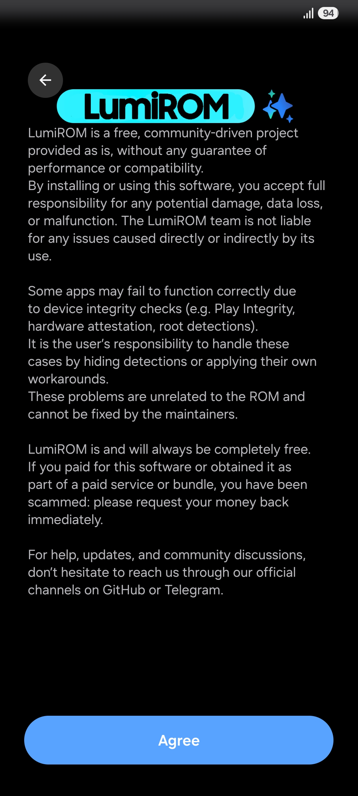

# What's changed on LumiROM 8.6.5?

## Fixes
- Fixed black recents preview by switching to the OpenGL renderer.
- Fixed app crashing due to vulkan.

## Features
- Added a full OTA update system with manifest and incremental support, so updates can be generated as small patches of the previous version.
- Added a LumiROM disclaimer page on First Time Setup, with the LumiROM banner and translated to 30 languages.
- The setup wizard now includes the navigation bar step, and the Recommended apps step is gone.
- Added software update onto settings that opens Cloudy.
- Added LumiROM logo to About software.
- Updated Cloudy to `2.4`.

## More
- [Repo] OTA builds: incremental target files in TARGET_FILES, OTA signing with LumiROM keys, official builds now detected by platform certificate (no more firmware-hash hacks).
- [Repo] CUSTOM_PLATFORM_SIGNATURE replaces the no-op DISABLE_SIGNATURE_VERIFICATION.
- [Repo] build_local.sh mirrors CI: SecSettings and SetupWizard are now decompiled, patched, rebuilt and resigned locally too.
- [Repo] Refactoring: FW build functions moved to FW.sh, app patches grouped in AppPatches.sh.

Next update will try to bring more fixes. Until then, enjoy the update!

# Screenshots

  

# Download
[Download LumiROM 8.6.5](https://t.me/LumiROMs)